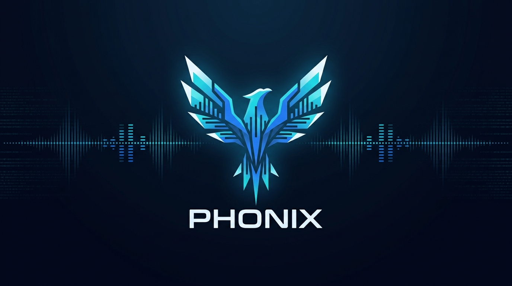

# PHONIX



PHONIX `v2.3.0` is a production-oriented Discord music bot built with TypeScript + Node.js. It is designed around stable playback, guild-aware recovery, operational diagnostics, guided command UX, actionable Discord panels, and an opt-in Admin Center that runs in the same runtime as the bot.

Visual identity: `Deep Space / Navy Core / Electric Blue / Cyan Signal / Ice White`

## What PHONIX actually does

- Discord music playback with slash commands and `!` prefix commands
- Smart queue insertion with `queue`, `next` and `replace` modes
- Guild-scoped `Smart Session` recovery with persisted queue state, `recover`, `resumequeue` and explicit session health
- Operational diagnostics through `doctor`, persistent telemetry and runtime incident history
- Personal favorites, playlists and playback history
- Owner-only operational control with `/owner` plus startup DM to the official owner account
- Opt-in Admin Center with Discord OAuth, guild filtering and administrative session hardening
- Action-oriented Discord panels that can refresh or steer the current session without spamming the channel

## Product surfaces

### Discord Bot

This is the primary PHONIX surface. Daily playback, session recovery, library actions, admin configuration, help and diagnostics are all available from Discord.

### Admin Center

The Admin Center is an opt-in web surface that runs inside the same process as the bot. It reuses `config`, `doctor`, recovery, session state and telemetry instead of introducing a separate backoffice stack.

Current Admin Center areas:

- `Overview`
- `Config`
- `Diagnostics`
- `Operations`

## Current release: `v2.3.0 - Discord Interaction System`

The current release line focuses on turning PHONIX panels into practical Discord work surfaces without dropping the operational clarity added in `Smart Session` and `Signal Surfaces`:

- `play`, `queue`, `nowplaying`, `recover`, `config view` and `doctor` now work as action-oriented panels, not just read-only status cards
- queue, now playing and doctor surfaces can refresh in place; `queue` can shuffle inline, `nowplaying` can pause/resume inline, and `config view` can toggle autoplay/resume queue inline
- the same panel message is updated in place, which reduces chat spam and keeps interaction anchored to the command that opened the surface
- selective `Components V2` adoption remains intentional for dense operational surfaces, while `help` stays on classic embeds plus select/button navigation because that UX is still clearer there
- premium recovery and library list surfaces introduced in `v2.2.0` stay intact, and library collections now gain selective quick actions such as `Tocar destaque` and `Abrir destaque` without replacing the explicit command-driven flows for indexed or named mutations
- PHONIX branding now leans on consistent assets, color states and hierarchy instead of emoji-heavy language
- `play` keeps its clearer operational entry report, including voice preparation, session reuse, confirmed playback start and runtime fallback/downgrade when it happens
- `queue`, `nowplaying` and `recover` continue to expose `session health`, recovery state and route context while becoming more practical to act on

## Architecture at a glance

```text
src/
  app/
  core/
  modules/
    commands/
    dashboard/
    diagnostics/
    library/
    music/
    ui/
  scripts/
    support/
docs/
  architecture/
  operations/
  verification/
  releases/
  governance/
tests/
  integration/
  smoke/
  support/
  unit/
prisma/
assets/
.github/
  workflows/
  ISSUE_TEMPLATE/
  PULL_REQUEST_TEMPLATE.md
```

High-level responsibilities:

- `src/app`: composition, bootstrap, shutdown and runtime wiring
- `src/core`: configuration, database, Discord client, logging, versioning and owner policy
- `src/modules/commands`: slash/prefix definitions, parsing, preconditions, presenters and help UI
- `src/modules/music`: playback, recovery, FFmpeg integration, queue/session orchestration and use cases
- `src/modules/library`: favorites, playlists, history, guild settings and persisted playback sessions
- `src/modules/diagnostics`: `doctor`, operational telemetry, incident history and owner control services
- `src/modules/dashboard`: Fastify server, OAuth, dashboard sessions and Admin Center use cases
- `src/modules/ui`: themes, embeds, command guides, view models and Components V2 panels
- `src/scripts`: operational scripts such as slash deployment and verification flows

Detailed architecture:

- [System Architecture](docs/architecture/system-architecture.md)
- [Admin Center](docs/architecture/admin-center.md)

## Real feature map

### Playback

- `/play` and `!play` / `!tocar`
- queue insertion modes: `queue`, `next`, `replace`
- `/pause`, `/resume`, `/skip`, `/stop`, `/volume`, `/queue`, `/nowplaying`
- `/recover` and `!retomar`
- guided errors for voice permissions, unsupported URLs, invalid sources and recovery conflicts
- richer `play` feedback for `started now` versus `queued`, with operational context about connection/session startup
- artwork-backed `nowplaying` and queue context when track metadata includes a usable thumbnail or cover
- in-place actions on the main Discord panels, including queue refresh/shuffle, now playing pause/resume and config toggles

### Smart Session and recovery

- persisted queue snapshots per guild
- startup recovery and manual `recover`
- session health states surfaced in `doctor`, `queue`, `nowplaying` and recovery feedback
- persisted playback config context such as volume, loop and autoplay when the saved session is reusable
- dedicated recovery panel with restored/skipped counts, reapplied config and session health summary

### Library

- `/favorite add`, `/favorite play`, `/favorite list`, `/favorite remove`
- `/playlist create`, `/playlist add`, `/playlist play`, `/playlist list`, `/playlist remove`, `/playlist delete`
- `/history`
- visual library panels for favorites, playlists and recent history, with artwork/source metadata when the stored item has usable media context
- quick actions on library panels for highlighted favorites, highlighted playlists and the most recent history item, while explicit index/name flows remain the source of truth for precise mutations

### Admin and diagnostics

- `/config view`, `/config prefix`, `/config volume`, `/config autoplay`, `/config resumequeue`
- `/doctor`
- guided administrative feedback for prefix, volume, recovery readiness and guild state
- premium `Components V2` panels for `config view` and `doctor`

### Owner control

Official runtime references:

- owner user ID: `976586934455513159`
- official guild ID: `1489363867023835310`

Owner surface:

- `/owner status`
- `/owner incidents`
- `/owner guilds`
- `/owner official-guild`
- `/owner notify-test`

The owner also receives an automatic startup DM when the bot comes online and the DM can be delivered successfully.

Detailed runbook:

- [Owner Control](docs/operations/owner-control.md)

## Playback model and source behavior

### YouTube

PHONIX uses `discord-player-youtubei` and can operate in two playback profiles:

- `compatibility`: default stable profile
- `fidelity`: opt-in profile that only becomes effective with a valid `YOUTUBE_COOKIE`

Important notes:

- `fidelity` falls back safely when the cookie or runtime requirements are not met
- when `fidelity` uses the `WEB` client, PHONIX also enables the extractor's `PoToken` path automatically
- PHONIX runs a short startup probe for `fidelity/youtubei`; if the native stream still fails, the runtime quarantines that path and is downgraded to `compatibility/youtube-dl` before the first real command
- if a real `fidelity/youtubei` stream open fails at runtime, PHONIX can downgrade the running YouTube route to `compatibility/youtube-dl` and retry once automatically
- `YOUTUBE_HIGH_WATER_MARK` helps stream smoothness and tolerance, not guaranteed fidelity
- `doctor` and verification scripts show requested profile, effective profile, pipeline, client and runtime downgrade reason when it exists

## Discord message surface

PHONIX now uses a hybrid message system on Discord:

- `Components V2`: `play`, `queue`, `nowplaying`, `recover`, `favorite list`, `playlist list`, `history`, `config view`, `doctor`
- classic embeds + action rows: `help`, short notices, library confirmations and compact transactional flows

This split is deliberate. Official Discord guidance for `Components V2` requires `IS_COMPONENTS_V2` and does not allow mixing those payloads with classic `content`/`embeds` in the same message, so PHONIX only uses V2 where layout density and scanability clearly improve the product.

### Spotify

Spotify support is optional and currently works through bridge behavior:

- PHONIX resolves metadata from Spotify links
- audio playback still uses a compatible playable source
- Spotify is not a source-of-truth for fidelity comparisons

### SoundCloud

- `NAO IMPLEMENTADO AINDA`: direct `source:soundcloud`

## Honest limitations

- PHONIX works in servers, not direct-message music sessions
- the Admin Center is complementary and does not replace the Discord surface
- the web panel does not play music, edit live queues or expose a public dashboard
- not every Discord surface should be `Components V2`; `help` remains classic for navigation ergonomics and precise library mutations still stay command-driven when indices and names are clearer than overloaded buttons
- exact resume from the previous playback timestamp is `NAO IMPLEMENTADO AINDA`
- real OAuth verification, Smart Session behavior after restart and owner DM delivery still require manual validation outside the automated suite

## Quick start

### 1. Install dependencies

```bash
npm install
```

### 2. Create `.env`

```bash
cp .env.example .env
```

PowerShell alternative:

```powershell
Copy-Item .env.example .env
```

### 3. Fill the minimum required bot settings

- `DISCORD_TOKEN`
- `DISCORD_CLIENT_ID`
- `DATABASE_URL`
- `BOT_PREFIX`

### 4. Generate Prisma Client

```bash
npm run prisma:generate
```

### 5. Deploy slash commands

```bash
npm run deploy:commands
```

### 6. Run in development

```bash
npm run dev
```

### 7. Build and start production

```bash
npm run build
npm run start
```

The SQLite bootstrap applies pending versioned migrations on startup.

## Admin Center quick start

The dashboard is opt-in. If the required web settings are not present, the bot still starts normally without HTTP routes.

Minimum web configuration:

```env
DISCORD_CLIENT_SECRET=
DASHBOARD_ENABLED=true
DASHBOARD_BASE_URL=http://localhost:3000
DASHBOARD_PORT=3000
DASHBOARD_SESSION_SECRET=
```

How access works:

- Discord OAuth2 login
- guild filtering to servers where the bot is installed
- additional filtering to users with administrative permission in that guild
- HTTP-only signed session cookies
- CSRF protection for mutations
- encrypted OAuth tokens at rest in SQLite
- revalidation of authorization during the session

Admin Center docs:

- [Admin Center](docs/architecture/admin-center.md)
- [Admin Center Verification](docs/verification/admin-center-verification.md)

## Command overview

### Playback

- `/play` or `!play` / `!tocar`
- `/pause`
- `/resume`
- `/skip` or `!pular`
- `/queue` or `!fila`
- `/nowplaying` or `!agora`
- `/stop` or `!parar`
- `/volume`
- `/recover` or `!retomar`

### Library

- `/favorite add`
- `/favorite play`
- `/playlist create`
- `/playlist add`
- `/playlist play`
- `/history`

### Admin

- `/config view`
- `/config prefix`
- `/config volume`
- `/config autoplay`
- `/config resumequeue`
- `/doctor`

### Owner

- `/owner status`
- `/owner incidents`
- `/owner guilds`
- `/owner official-guild`
- `/owner notify-test`

### Help

- `/help`
- `!help`

Notes:

- `config` and `doctor` are admin-only for guild admins
- the global owner has controlled prefix bypass through `!config`, `!doctor` and `!owner`
- `favorite add` and `playlist add` reuse the current track when `query` is omitted
- `favorite play` and `playlist play` reuse the same voice and permission preflight used by playback
- `join`, `leave` and standalone `autoplay` are not part of the current public command surface

## Environment variables

### Required bot settings

- `DISCORD_TOKEN`
- `DISCORD_CLIENT_ID`
- `DATABASE_URL`
- `BOT_PREFIX`

### Optional bot settings

- `DISCORD_PUBLIC_KEY`
- `DISCORD_GUILD_ID`
- `SPOTIFY_CLIENT_ID`
- `SPOTIFY_CLIENT_SECRET`
- `FFMPEG_PATH`
- `YOUTUBE_PLAYBACK_PROFILE`
- `YOUTUBE_STREAM_CLIENT`
- `YOUTUBE_COOKIE`
- `YOUTUBE_HIGH_WATER_MARK`

### Optional Admin Center settings

- `DISCORD_CLIENT_SECRET`
- `DASHBOARD_ENABLED`
- `DASHBOARD_BASE_URL`
- `DASHBOARD_PORT`
- `DASHBOARD_SESSION_SECRET`

See [.env.example](.env.example) for the current configuration template.

## Observability and verification

Operational tooling currently includes:

- `doctor` for runtime diagnostics
- persistent operational telemetry and incident history
- session health visibility in recovery and playback panels
- owner startup DM with operational snapshot
- local verification scripts for playback and dashboard

Useful scripts:

- `npm run typecheck`
- `npm run build`
- `npm test`
- `npm run test:smoke`
- `npm run verify:playback`
- `npm run verify:dashboard`

Verification docs:

- [Playback Verification](docs/verification/playback-verification.md)
- [Playback Verification Results](docs/verification/playback-verification-results.md)
- [Admin Center Verification](docs/verification/admin-center-verification.md)

## Public repository standards in this tree

- issue templates under [`.github/ISSUE_TEMPLATE/`](.github/ISSUE_TEMPLATE)
- PR checklist under [`.github/PULL_REQUEST_TEMPLATE.md`](.github/PULL_REQUEST_TEMPLATE.md)
- security policy under [`SECURITY.md`](SECURITY.md)
- repository profile and release policy under [`docs/governance/`](docs/governance)
- documentation index under [docs/README.md](docs/README.md)

## Documentation map

- [Docs index](docs/README.md)
- [System Architecture](docs/architecture/system-architecture.md)
- [Admin Center](docs/architecture/admin-center.md)
- [Owner Control](docs/operations/owner-control.md)
- [Playback Verification](docs/verification/playback-verification.md)
- [Playback Verification Results](docs/verification/playback-verification-results.md)
- [Admin Center Verification](docs/verification/admin-center-verification.md)
- [Project Tracker](docs/releases/project-tracker.md)
- [Changelog](docs/releases/changelog.md)
- [Repository Profile](docs/governance/repository-profile.md)
- [Release Policy](docs/governance/release-policy.md)

## Assets

- Logo: [assets/logo.png](assets/logo.png)
- Avatar: [assets/avatar.png](assets/avatar.png)
- Banner: [assets/banner.png](assets/banner.png)
- SVG alternatives:
  - [assets/logo.svg](assets/logo.svg)
  - [assets/avatar.svg](assets/avatar.svg)
  - [assets/banner.svg](assets/banner.svg)

## Operational notes

- Rotate secrets immediately if Discord tokens, Spotify secrets or YouTube cookies were exposed.
- Use `doctor` before deep playback troubleshooting.
- Use the verification runbooks instead of ad-hoc testing when validating `fidelity`, dashboard OAuth or owner control behavior.
